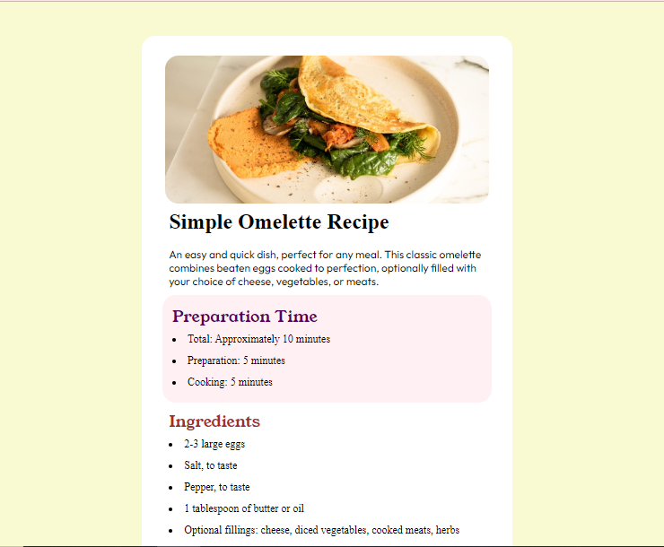

# Recipe pag

## 📌 About ##
 

 Português:   
    Este projeto é um card de receita desenvolvido como parte de um desafio do Frontend Mentor. Ele foi criado para praticar habilidades em HTML e CSS. O card exibe uma receita fictícia com uma imagem, título, ingredientes e instruções. É uma ótima oportunidade para aprender e aprimorar técnicas de design responsivo e layout.

English:  
    This project is a recipe card developed as part of a Frontend Mentor challenge. It was created to practice HTML and CSS skills. The card displays a fictitious recipe with an image, title, ingredients, and instructions. It's a great opportunity to learn and refine responsive design and layout techniques.

## ⚒️ Tools 

- HTML5    
&nbsp;

- CSS3    
&nbsp;

## 💻 Preview <a href="https://pceraa.github.io/recipe-pag/" target="_blank">🔗</a>

## 📃 License 

This project is under the MIT license. See the file [LICENSE](./LICENSE) for more details
